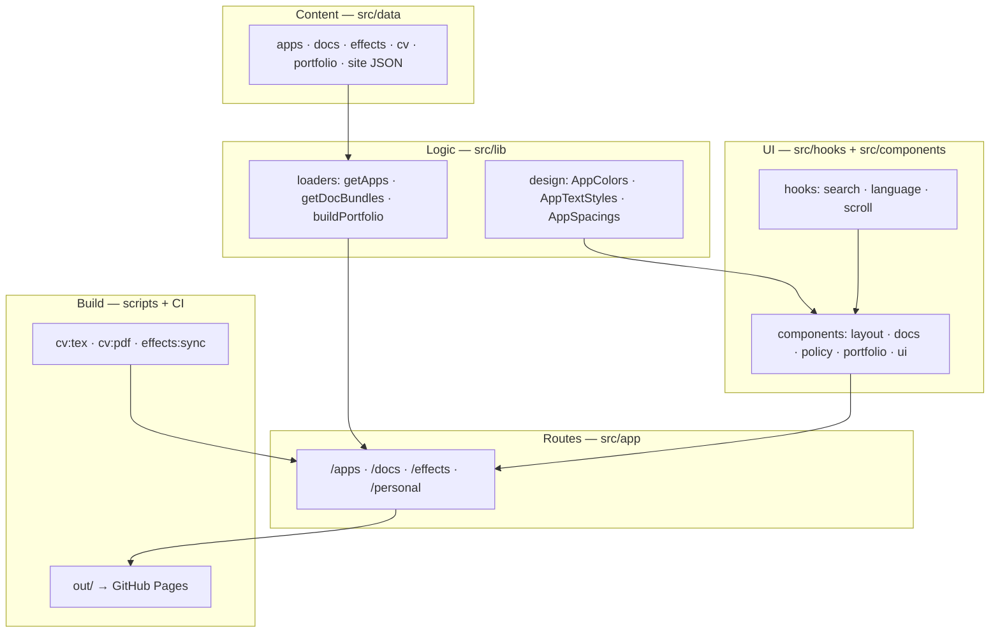

# Personal work space

| | |
|---|---|
| Overview | Static site publishing Dam Hong Duc's app privacy policies, bilingual setup guides, a video-editing effects library, a portfolio and a CV |
| Last edit | 2026-09-29 |
| Author | Dam Hong Duc |

## Store links

| Platform | Link |
|---|---|
| Web (GitHub Pages) | https://damhongduc.github.io/personal_work_space |

## App IDs

| ID | Value |
|---|---|
| iOS bundle ID | None — web project |
| Android app ID | None — web project |
| Android namespace | None — web project |

## Tech stack

| Category | Technology | Version |
|---|---|---|
| Framework | Next.js (App Router, `output: "export"`) | 16.3.0 |
| Language | TypeScript | 5.9.3 |
| State management | React state and hooks, no store library | React 19.2.8 |
| Backend | None — static export; effect uploads call the Google Drive API from the browser | — |
| Local DB | None — `localStorage` only for the guide language and scroll memory | — |
| Special libraries | Tailwind CSS · shadcn/ui on Radix · react-icons · LaTeX CV pipeline | 4.3.3 · 1.6.7 · 5.7.0 · — |

## Project architecture

| | |
|---|---|
| Architecture | Layered, content-driven static site: JSON → loaders → components → routes |
| Encryption | None — no data is stored or encrypted by the site; GitHub Pages serves it over HTTPS |

