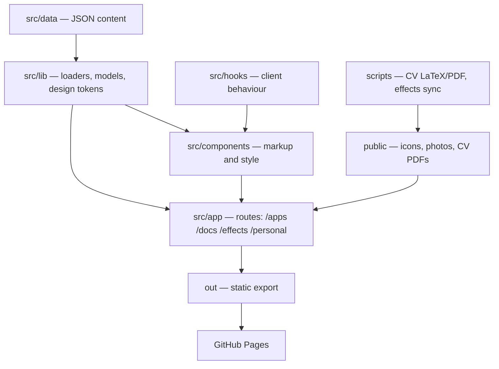

# Personal work space

| | |
|---|---|
| Overview | Static site publishing Dam Hong Duc's app privacy policies, bilingual setup guides, a video-editing effects library, a portfolio and a CV |
| Last edit | 2026-09-29 |
| Author | Dam Hong Duc |

## Store links

| Platform | Link |
|---|---|
| Web (GitHub Pages) | https://damhongduc.github.io/personal_work_space |

## App IDs

| Platform | Flavor / scheme | ID type | Value |
|---|---|---|---|
| Web | GitHub Pages | Base path | Set by CI as `NEXT_PUBLIC_BASE_PATH` (the repository name) |

## Tech stack

| Category | Technology | Version |
|---|---|---|
| Framework | Next.js (App Router, `output: "export"`) | 16.3.0 |
| UI | React | 19.2.8 |
| Language | TypeScript | 5.9.3 |
| Styling | Tailwind CSS | 4.3.3 |
| Components | shadcn/ui on Radix (`radix-ui`) | 1.6.7 |
| Icons | lucide-react, react-icons | 1.33.0, 5.7.0 |
| Tests | Vitest + jsdom | 4.1.10 |
| CV | LaTeX (pdfLaTeX in CI, Tectonic locally) + poppler | — |
| Runtime | Node.js | >= 22.18 |
| Hosting / CI | GitHub Pages, GitHub Actions | — |

## Project architecture

