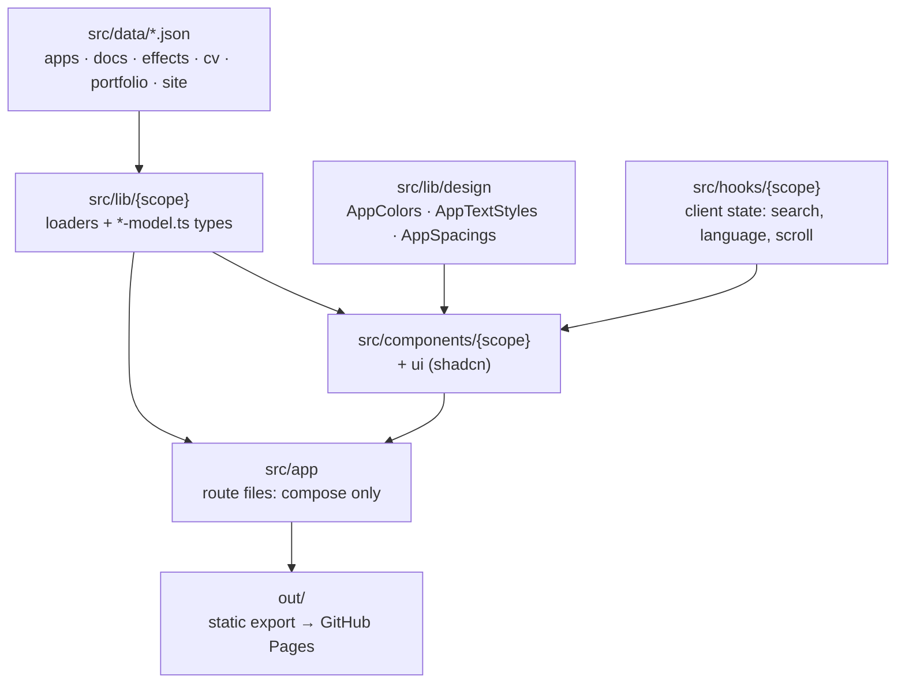
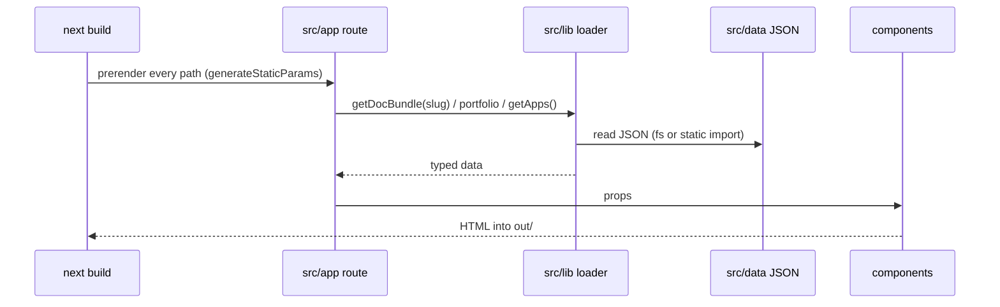
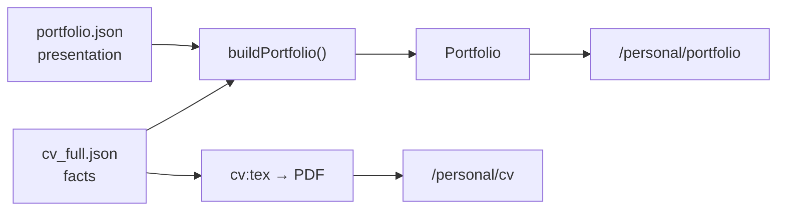

# Architecture

## Layers

| Layer | Folder | Responsibility | May depend on |
|---|---|---|---|
| Content | `src/data/` | All copy and facts, as JSON | — |
| Loaders | `src/lib/<scope>/` | Read and shape content at build time (`node:fs`, server-only) | Content, `resource-constant.mts` |
| Models | `src/lib/<scope>/*-model.ts` | Types and constants safe for the browser | Nothing server-side |
| Tokens | `src/lib/design/` | Colours, type roles, page gaps | Nothing |
| Hooks | `src/hooks/<scope>/` | Client behaviour: search, language, scroll, standalone header | Models |
| Components | `src/components/<scope>/` | All markup and styling | Models, tokens, hooks, `ui` |
| Routes | `src/app/` | Compose components per URL; no `className`/`style` | Loaders, components |
| Scripts | `scripts/` | CV LaTeX/PDF, effects sync, commit check | `resource-constant.mts` |

## Data flow: building a page

## Portfolio data

## Key decisions

| Decision | Reason | Trade-off |
|---|---|---|
| Static export (`output: "export"`) | Free hosting on GitHub Pages | No server: no `next start`, search is client-side, uploads go straight to Drive |
| Content in JSON, never markup | Edit content without touching UI | Rules enforced by tests, not types alone |
| One CV feeds the PDF and the portfolio | Facts cannot drift | Portfolio-only copy needs its own CV field (`portfolioAbout`) |
| Dark mode by media query only | Correct first paint without JavaScript | No manual toggle |
| CSS animation, JavaScript only for timing | Works without script; honours reduced motion | Needs IntersectionObserver for scroll entrances |
| Paths in `ResourceConstant`, URLs in `routes` | Renames happen once | — |

## Where to add things

| Task | Location |
|---|---|
| App privacy policy | `src/data/apps/<slug>.json` — [guide](guides/apps.md) |
| Guide | `src/data/docs/{en,vi}/<slug>_{en,vi}.json` — [rules](claude/content.md) |
| CV version | `src/data/cv/<slug>.json` + `src/lib/cv/cv.ts` — [guide](guides/cv.md) |
| Portfolio fact | The CV JSON; presentation in `src/data/portfolio.json` |
| New URL | `src/lib/routes/routes.ts` + folder under `src/app/` |
| New component | `src/components/<scope>/` |
| New colour, text role or page gap | `src/lib/design/` |
| New content path | `src/lib/resource-constant.mts` |
