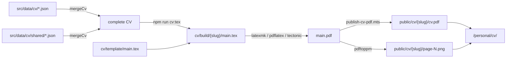

# CV

The CV is generated: edit the JSON in `src/data/cv/`, never the LaTeX.

## Files

| Path | What | In git |
|---|---|---|
| `src/data/cv/cv_with_freelancer.json` | Full history, freelance work included; the default version and the portfolio's source | Yes |
| `src/data/cv/cv_normal.json` | Without the freelance work | Yes |
| `src/data/cv/shared/*.json` | What both versions share: `header`, `education`, `projects`, and `experience` — every job, keyed by id | Yes |
| `cv/template/main.tex` | Layout: preamble + one `%%PLACEHOLDER%%` per section | Yes |
| `public/personal/avt.jpg` | CV photo (the portfolio has its own) | Yes |
| `cv/build/<slug>/` | Generated LaTeX + photo | No |
| `public/cv/<slug>/cv.pdf`, `page-N.png` | Download and page images the site renders | No |
| `public/cv.pdf` | Copy of the default, for links already in the wild | No |

## Pipeline

## Commands

| Task | Command |
|---|---|
| Regenerate and run the site | `npm run dev` |
| JSON → LaTeX (+ photo) | `npm run cv:tex` |
| LaTeX → PDF → images (needs LaTeX, poppler) | `npm run cv:pdf` |
| Check data and generated LaTeX | `npm test` |

## Adding a version

| Step | File |
|---|---|
| Add `src/data/cv/<slug>.json`: `label`, `lastUpdated`, `aboutMe`, `skills`, and `experience` as job ids from `shared/experience.json` | New file |
| Import it by name | [src/lib/cv/cv.ts](../../src/lib/cv/cv.ts) |
| Optional: make it the landing version | `ResourceConstant.CV_DATA_FILE` |

## Shared or per version

| Part | Where | Note |
|---|---|---|
| `header`, `education`, `projects` | `shared/<part>.json` | Every version prints the same |
| A job | `shared/experience.json`, under an id such as `oivan` | A version lists ids in print order: `"experience": ["oivan", "flynk"]` |
| `label`, `lastUpdated`, `aboutMe`, `portfolioAbout`, `skills` | The version file | What sets a version apart |
| An unknown job id | — | Fails `npm run cv:tex` and `npm test` |
| A job no version lists | — | Fails `npm test` |

## Writing the JSON

| You write | The PDF shows |
|---|---|
| `Backend & Integration` | Backend & Integration |
| `get_it` | get_it |
| `2019 – 2023` (en dash) | 2019 – 2023 |
| `a — b` (em dash) | a — b |
| `Flutter · Team size: 4` | Flutter · Team size: 4 |
| `href` URLs | Passed as-is; only `%` and `#` escaped |

| Field rule | Detail |
|---|---|
| `lastUpdated` | Bump on every change; the site shows it. A change under `shared/` bumps every version |
| `location` | Ends with `, Viet Nam` |
| `url` (education, experience) | Optional website, linked in the PDF and on the portfolio |
| `portfolioAbout` | Portfolio-only introduction; `{{years}}` is filled at build |

## Previewing without LaTeX

| Way | How |
|---|---|
| Overleaf | `npm run cv:tex`, drag `cv/build/<slug>/` into a new project |
| CI | Open a PR, download the `cv-pdf` artifact |

## Gotchas

| Issue | Why | What to do |
|---|---|---|
| Local PDF uses Latin Modern, not Charter | XeTeX (Tectonic) defaults to TU; `charter` ships only T1/OT1 | Keep `\usepackage[T1]{fontenc}` on the non-pdfTeX branch |
| A placeholder prints as `%%AWARDS%%` | — | Cannot happen: an unknown placeholder fails the build |
| PDF grows large | Photo prints at 3.2cm | Keep the photo ~800px JPEG |
| The CV page says the PDF is missing | No LaTeX or poppler locally | Expected; CI builds the deployed PDF |
